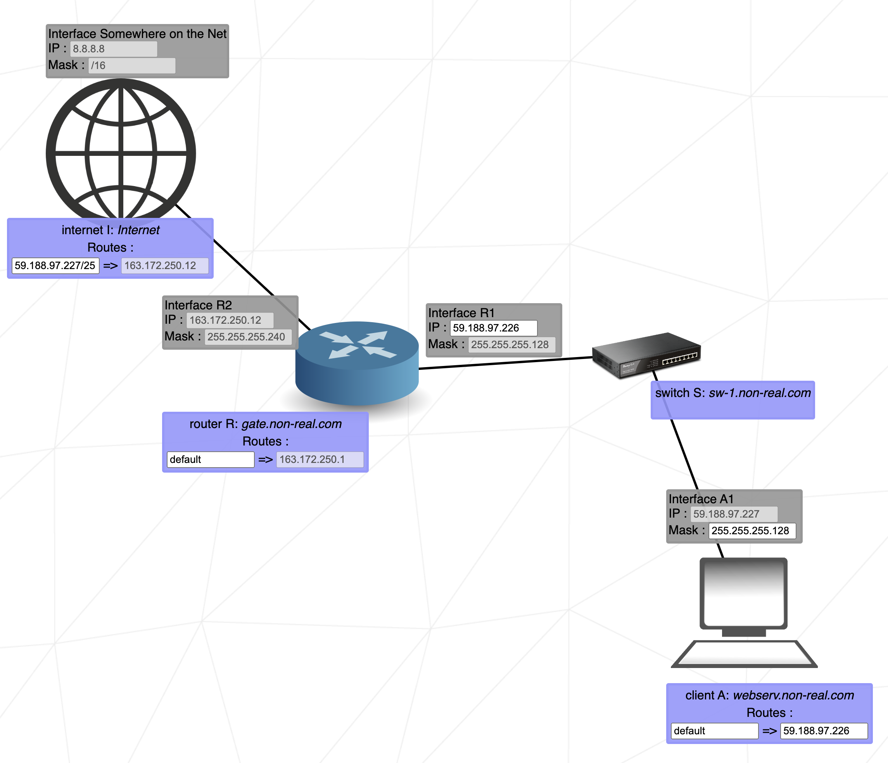
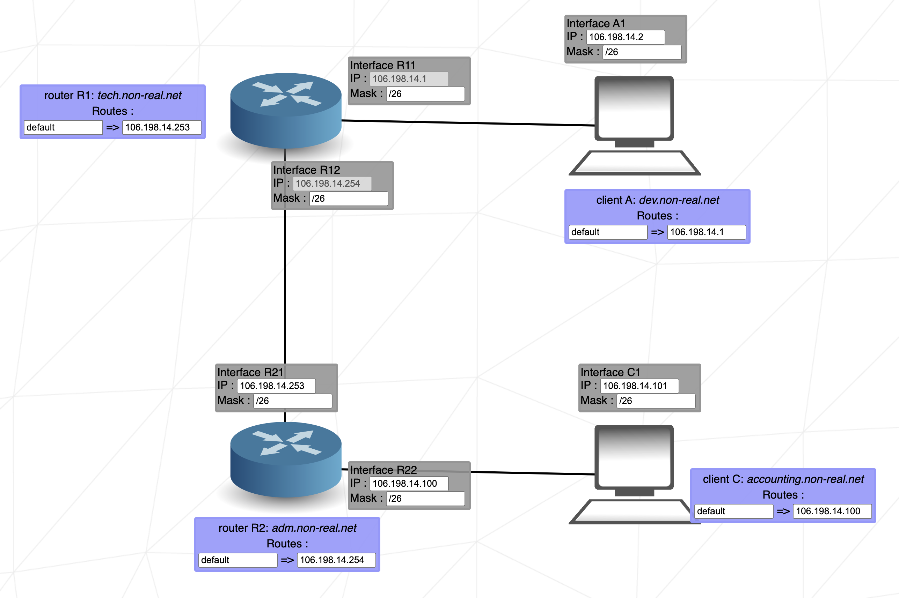
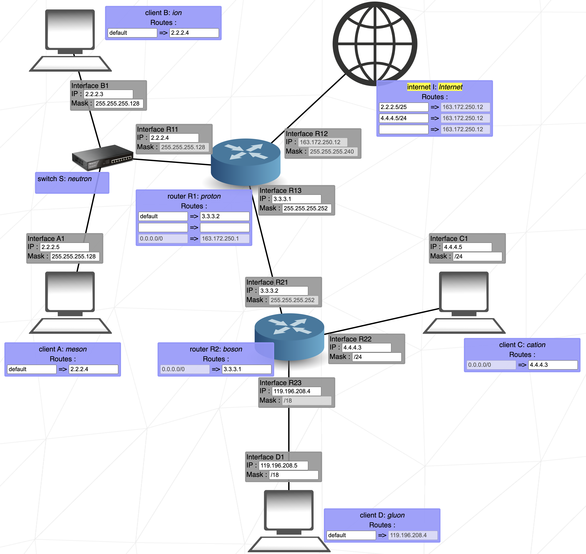
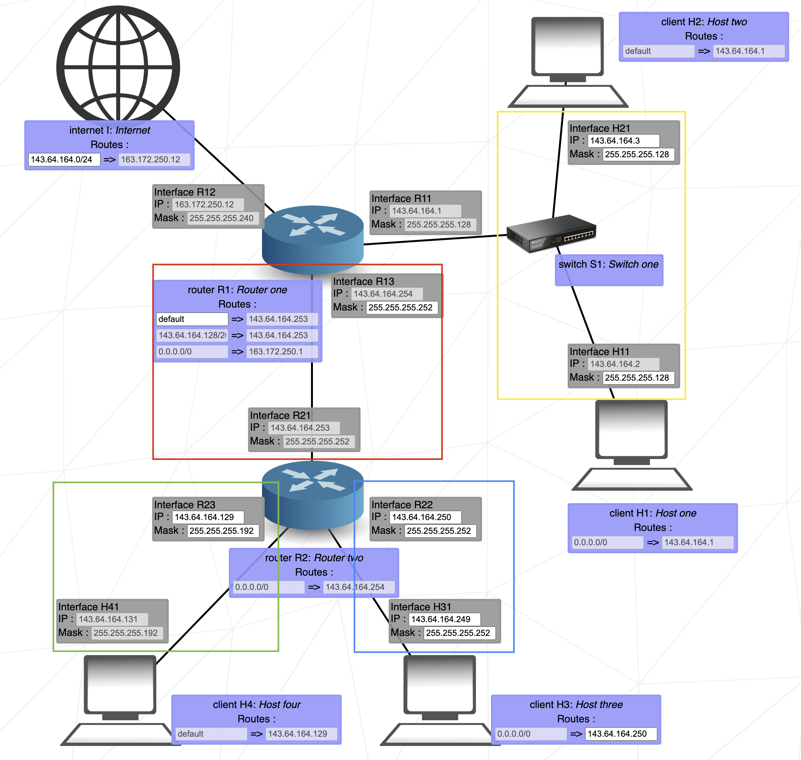

# NetPractice
10 exercices intéractifs pour apprendre les bases du réseaux

# Router

Tout comme le switch relie plusieurs appareils sur un même réseau, le routeur relie plusieurs réseaux entre eux. Le routeur possède **une interface pour chaque réseau** auquel il se connecte.

Étant donné que le routeur sépare différents réseaux, la plage d'adresses IP possibles sur l'une de ses interfaces **ne doit pas se chevaucher avec la plage de ses autres interfaces**. Un chevauchement de la plage d'adresses IP impliquerait que les interfaces se trouvent sur le même réseau.

## Routing table

Une table de routage est une table de données stockée dans un routeur ou un hôte réseau qui répertorie les itinéraires vers des destinations réseau particulières. Dans NetPractice, la table de routage se compose de deux éléments :

- **La destination** : La destination spécifie une adresse réseau sur laquelle un hôte est la cible finale des paquets. La route par défaut ou 0.0.0.0/0, est la route qui prend effet lorsqu'aucune autre route n'est disponible pour une adresse de destination IP. La route par défaut utilise l'adresse du saut suivant pour envoyer les paquets sans donner de destination spécifique. L'itinéraire par défaut correspond à n'importe quel réseau.
- **Saut suivant** : Le saut suivant désigne le routeur le plus proche par lequel un paquet peut passer. Il s'agit de l'adresse IP du routeur suivant sur le chemin du paquet. Chaque routeur maintient sa table de routage avec une adresse de saut suivant.

# A propos du chevauchement des sous-réseaux

According to the search results, it is generally not recommended to use the same subnet mask for each interface on a dual interface router. Here's why:

- Overlapping subnets: If both interfaces have IP addresses in the same subnet, it can cause conflicts and connectivity issues. For example, if one interface has an IP address of 192.168.0.1/24 and the other interface has an IP address of 192.168.0.129/25, they overlap and cannot be used simultaneously.
- Connectivity issues: Assigning multiple NICs (network interface cards) on the same subnet is a common cause of connectivity issues on multi-NIC systems. Different operating systems may handle this situation differently, with some mistakenly attempting to send packets out of the wrong interface.
- Best practices: It is recommended to configure each NIC (network interface card) on a different subnet to avoid communication problems[^4^]. Assigning multiple NICs to different subnets can help increase bandwidth or separate wired and wireless networks[^4^].

However, there may be some scenarios where using the same subnet mask for each interface is acceptable or even necessary. For example:

- NAT (Network Address Translation): When multiple public IP addresses are mapped across the same router and forwarded differently, using the same subnet mask for each interface may be necessary[^2^].
- Services bound to specific IP addresses: If you have services that are bound to specific IP addresses and using different default gateways, you may need to use the same subnet mask for each interface[^2^].
- Renumbering network: When renumbering a network, you may temporarily use multiple IP addresses for key devices and route between them[^2^].

It's important to note that these scenarios are less common and specific to certain network setups. It's generally recommended to follow best practices by assigning different subnets to each interface on a dual interface router.

# Exemples de range de sous réseaux

Range possibles pour l’adresse réseau 132.117.88.0/26

| Network Address | Usable Host Range | Broadcast Address: |
| --- | --- | --- |
| 132.117.88.0 | 132.117.88.1 - 132.117.88.62 | 132.117.88.63 |
| 132.117.88.64 | 132.117.88.65 - 132.117.88.126 | 132.117.88.127 |
| 132.117.88.128 | 132.117.88.129 - 132.117.88.190 | 132.117.88.191 |
| 132.117.88.192 | 132.117.88.193 - 132.117.88.254 | 132.117.88.255 |

Range possibles pour l’adresse réseau 132.117.88.0/28

| Network Address | Usable Host Range | Broadcast Address: |
| --- | --- | --- |
| 132.117.88.0 | 132.117.88.1 - 132.117.88.14 | 132.117.88.15 |
| 132.117.88.16 | 132.117.88.17 - 132.117.88.30 | 132.117.88.31 |
| 132.117.88.32 | 132.117.88.33 - 132.117.88.46 | 132.117.88.47 |
| 132.117.88.48 | 132.117.88.49 - 132.117.88.62 | 132.117.88.63 |
| 132.117.88.64 | 132.117.88.65 - 132.117.88.78 | 132.117.88.79 |
| 132.117.88.80 | 132.117.88.81 - 132.117.88.94 | 132.117.88.95 |
| 132.117.88.96 | 132.117.88.97 - 132.117.88.110 | 132.117.88.111 |
| 132.117.88.112 | 132.117.88.113 - 132.117.88.126 | 132.117.88.127 |
| 132.117.88.128 | 132.117.88.129 - 132.117.88.142 | 132.117.88.143 |
| 132.117.88.144 | 132.117.88.145 - 132.117.88.158 | 132.117.88.159 |
| 132.117.88.160 | 132.117.88.161 - 132.117.88.174 | 132.117.88.175 |
| 132.117.88.176 | 132.117.88.177 - 132.117.88.190 | 132.117.88.191 |
| 132.117.88.192 | 132.117.88.193 - 132.117.88.206 | 132.117.88.207 |
| 132.117.88.208 | 132.117.88.209 - 132.117.88.222 | 132.117.88.223 |
| 132.117.88.224 | 132.117.88.225 - 132.117.88.238 | 132.117.88.239 |
| 132.117.88.240 | 132.117.88.241 - 132.117.88.254 | 132.117.88.255 |

Ranges possibles pour l’adresse réseau 163.237.250.0/28

| Network Address | Usable Host Range | Broadcast Address: |
| --- | --- | --- |
| 163.237.250.0 | 163.237.250.1 - 163.237.250.14 | 163.237.250.15 |
| 163.237.250.16 | 163.237.250.17 - 163.237.250.30 | 163.237.250.31 |
| 163.237.250.32 | 163.237.250.33 - 163.237.250.46 | 163.237.250.47 |
| 163.237.250.48 | 163.237.250.49 - 163.237.250.62 | 163.237.250.63 |
| 163.237.250.64 | 163.237.250.65 - 163.237.250.78 | 163.237.250.79 |
| 163.237.250.80 | 163.237.250.81 - 163.237.250.94 | 163.237.250.95 |
| 163.237.250.96 | 163.237.250.97 - 163.237.250.110 | 163.237.250.111 |
| 163.237.250.112 | 163.237.250.113 - 163.237.250.126 | 163.237.250.127 |
| 163.237.250.128 | 163.237.250.129 - 163.237.250.142 | 163.237.250.143 |
| 163.237.250.144 | 163.237.250.145 - 163.237.250.158 | 163.237.250.159 |
| 163.237.250.160 | 163.237.250.161 - 163.237.250.174 | 163.237.250.175 |
| 163.237.250.176 | 163.237.250.177 - 163.237.250.190 | 163.237.250.191 |
| 163.237.250.192 | 163.237.250.193 - 163.237.250.206 | 163.237.250.207 |
| 163.237.250.208 | 163.237.250.209 - 163.237.250.222 | 163.237.250.223 |
| 163.237.250.224 | 163.237.250.225 - 163.237.250.238 | 163.237.250.239 |
| 163.237.250.240 | 163.237.250.241 - 163.237.250.254 | 163.237.250.255 |

[IPview.pdf](IPview.pdf)

# Tips pour les 5 derniers niveaux

## Level 6

## Level 7

DEFAULT PARTOUT

## Level 8

- Les range autorisées pour les 3 sous-réseaux à configurer :

| **Network Address** | **Usable Host Range** | **Broadcast Address:** |
| --- | --- | --- |
| 129.32.11.0 | 129.32.11.1 - 129.32.11.62 | 129.32.11.63 |
| 129.32.11.64 | 129.32.11.65 - 129.32.11.126 | 129.32.11.127 |
| 129.32.11.128 | 129.32.11.129 - 129.32.11.190 | 129.32.11.191 |
| 129.32.11.192 | 129.32.11.193 - 129.32.11.254 | 129.32.11.255 |

| **Network Address** | **Usable Host Range** | **Broadcast Address:** |
| --- | --- | --- |
| 129.32.11.0 | 129.32.11.1 - 129.32.11.14 | 129.32.11.15 |
| 129.32.11.16 | 129.32.11.17 - 129.32.11.30 | 129.32.11.31 |
| 129.32.11.32 | 129.32.11.33 - 129.32.11.46 | 129.32.11.47 |
| 129.32.11.48 | 129.32.11.49 - 129.32.11.62 | 129.32.11.63 |
| 129.32.11.64 | 129.32.11.65 - 129.32.11.78 | 129.32.11.79 |
| 129.32.11.80 | 129.32.11.81 - 129.32.11.94 | 129.32.11.95 |
| 129.32.11.96 | 129.32.11.97 - 129.32.11.110 | 129.32.11.111 |
| 129.32.11.112 | 129.32.11.113 - 129.32.11.126 | 129.32.11.127 |
| 129.32.11.128 | 129.32.11.129 - 129.32.11.142 | 129.32.11.143 |
| 129.32.11.144 | 129.32.11.145 - 129.32.11.158 | 129.32.11.159 |
| 129.32.11.160 | 129.32.11.161 - 129.32.11.174 | 129.32.11.175 |
| 129.32.11.176 | 129.32.11.177 - 129.32.11.190 | 129.32.11.191 |
| 129.32.11.192 | 129.32.11.193 - 129.32.11.206 | 129.32.11.207 |
| 129.32.11.208 | 129.32.11.209 - 129.32.11.222 | 129.32.11.223 |
| 129.32.11.224 | 129.32.11.225 - 129.32.11.238 | 129.32.11.239 |
| 129.32.11.240 | 129.32.11.241 - 129.32.11.254 | 129.32.11.255 |

- DEFAULT PARTOUT !!!

## Level 9

DEFAULT PARTOUT SAUF POUR LA TABLE DE ROUTAGE INTERNET

## Level 10

Plusieurs sous-réseaux sont utilisés :

| **Network Address** | **Usable Host Range** | **Broadcast Address:** |
| --- | --- | --- |
| 143.64.164.0 | 143.64.164.1 - 143.64.164.126 | 143.64.164.127 |
| 143.64.164.128 | 143.64.164.129 - 143.64.164.254 | 143.64.164.255 |

| **Network Address** | **Usable Host Range** | **Broadcast Address:** |
| --- | --- | --- |
| 143.64.164.0 | 143.64.164.1 - 143.64.164.62 | 143.64.164.63 |
| 143.64.164.64 | 143.64.164.65 - 143.64.164.126 | 143.64.164.127 |
| 143.64.164.128 | 143.64.164.129 - 143.64.164.190 | 143.64.164.191 |
| 143.64.164.192 | 143.64.164.193 - 143.64.164.254 | 143.64.164.255 |

| **Network Address** | **Usable Host Range** | **Broadcast Address:** |
| --- | --- | --- |
| 143.64.164.208 | 143.64.164.209 - 143.64.164.210 | 143.64.164.211 |
| 143.64.164.212 | 143.64.164.213 - 143.64.164.214 | 143.64.164.215 |
| 143.64.164.216 | 143.64.164.217 - 143.64.164.218 | 143.64.164.219 |
| 143.64.164.220 | 143.64.164.221 - 143.64.164.222 | 143.64.164.223 |
| 143.64.164.224 | 143.64.164.225 - 143.64.164.226 | 143.64.164.227 |
| 143.64.164.228 | 143.64.164.229 - 143.64.164.230 | 143.64.164.231 |
| 143.64.164.232 | 143.64.164.233 - 143.64.164.234 | 143.64.164.235 |
| 143.64.164.236 | 143.64.164.237 - 143.64.164.238 | 143.64.164.239 |
| 143.64.164.240 | 143.64.164.241 - 143.64.164.242 | 143.64.164.243 |
| 143.64.164.244 | 143.64.164.245 - 143.64.164.246 | 143.64.164.247 |
| 143.64.164.248 | 143.64.164.249 - 143.64.164.250 | 143.64.164.251 |
| 143.64.164.252 | 143.64.164.253 - 143.64.164.254 | 143.64.164.255 |

# Sources

[netprac.numbers](netprac.numbers)

[NetPractice](https://medium.com/@imyzf/netpractice-2d2b39b6cf0a)
